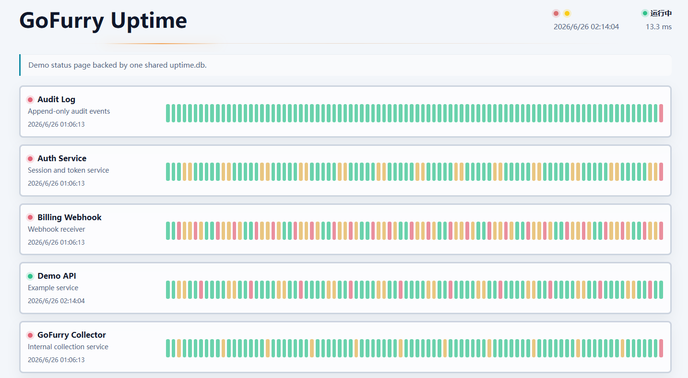

# uptime

<p align="center">
  &nbsp&nbsp&nbsp
  &nbsp&nbsp&nbsp
  <a href="https://github.com/gofurry/uptime/actions/workflows/ci.yml"></a>&nbsp&nbsp&nbsp
  <a href="https://goreportcard.com/report/github.com/gofurry/uptime"></a>&nbsp&nbsp&nbsp
</p>

<p align="left">
  <a href="../../README.md">English</a> | 中文
</p>

一个用于记录 Go `net/http` 服务历史可用性的轻量中间件。

- 后台定时写入 heartbeat 样本
- 展示最近 N 天的可用性竖条
- SQLite 适合同机单机部署，PostgreSQL 适合共享存储和多实例部署
- 不依赖 Prometheus、Grafana 或外部监控系统
- 与 `gofurry/monitor` 互补：monitor 展示实时运行状态，uptime 展示历史在线率

<p align="center">
  
</p>

## 安装

```bash
go get github.com/gofurry/uptime
```

## 快速开始

```go
package main

import (
	"log"
	"net/http"

	"github.com/gofurry/uptime"
	"github.com/gofurry/uptime/store/sqlite"
)

func main() {
	up, err := uptime.New(uptime.Config{
		ServiceID:   "demo-api",
		ServiceName: "Demo API",
		Store: sqlite.New(sqlite.Config{
			Path: "./uptime.db",
		}),
	})
	if err != nil {
		log.Fatal(err)
	}
	defer up.Close()

	mux := http.NewServeMux()
	mux.Handle("/uptime", up.Handler())
	mux.Handle("/uptime/", up.Handler())
	mux.Handle("/", up.Middleware(http.HandlerFunc(func(w http.ResponseWriter, r *http.Request) {
		_, _ = w.Write([]byte("hello"))
	})))

	log.Fatal(http.ListenAndServe(":8080", mux))
}
```

打开：

- `http://localhost:8080/uptime`
- `http://localhost:8080/uptime/api/status`

## Fiber

`uptime` 基于 `net/http`。Fiber 基于 `fasthttp`，因此最稳妥的集成方式是在启动阶段创建一个 `uptime` 实例，然后通过 Fiber 官方 adaptor 暴露 uptime handler。

> 重要：不要在 Fiber handler 内部调用 `uptime.New`。每个 `Uptime` 实例都会打开 store，并启动一个后台 heartbeat goroutine。

```go
package main

import (
	"log"

	"github.com/gofiber/fiber/v2"
	"github.com/gofiber/fiber/v2/middleware/adaptor"
	"github.com/gofurry/uptime"
	"github.com/gofurry/uptime/store/sqlite"
)

func main() {
	up, err := uptime.New(uptime.Config{
		ServiceID:   "demo-api",
		ServiceName: "Demo API",
		Store: sqlite.New(sqlite.Config{
			Path: "./uptime.db",
		}),
	})
	if err != nil {
		log.Fatal(err)
	}
	defer up.Close()

	app := fiber.New()
	uptimeHandler := adaptor.HTTPHandler(up.Handler())
	app.All("/uptime", uptimeHandler)
	app.All("/uptime/*", uptimeHandler)

	app.Get("/", func(c *fiber.Ctx) error {
		return c.SendString("hello")
	})

	log.Fatal(app.Listen(":8080"))
}
```

打开 `http://localhost:8080/uptime`。

`/uptime/*` 路由用于 `/uptime/api/status`，dashboard 刷新和自定义客户端都会用到它。`uptime` 通过自己的 heartbeat ticker 记录服务可用性，因此不需要包装每一个 Fiber 业务路由。

## 模拟数据

生成一个包含多个服务、多个实例和 90 天历史数据的本地 `uptime.db`：

```bash
go run ./cmd/uptime-demo-data -path ./uptime.db -reset=true
go run ./examples/basic
```

示例服务会继续写入自己的 heartbeat，同时 dashboard 会读取同一个数据库文件里的所有服务。

## 只挂 Dashboard

`uptime` 不依赖业务请求。heartbeat 由后台 ticker 写入，所以只注册页面也可以工作：

```go
mux.Handle("/uptime", up.Handler())
mux.Handle("/uptime/", up.Handler())
```

`Middleware` 目前只是 pass-through 适配器，用于保持常见 `net/http` 集成方式，并为未来可能的请求感知能力预留入口。

## PostgreSQL

当多个服务实例需要共享一个中心化 uptime 数据库时，使用 `store/postgres`：

```go
package main

import (
	"log"
	"net/http"

	"github.com/gofurry/uptime"
	"github.com/gofurry/uptime/store/postgres"
)

func main() {
	up, err := uptime.New(uptime.Config{
		ServiceID:   "demo-api",
		ServiceName: "Demo API",
		Store: postgres.New(postgres.Config{
			Host:        "127.0.0.1",
			Port:        5432,
			Database:    "postgres",
			Username:    "postgres",
			Password:    "password",
			SSLMode:     "disable",
			Schema:      "public",
			TablePrefix: "uptime_",
		}),
	})
	if err != nil {
		log.Fatal(err)
	}
	defer up.Close()

	mux := http.NewServeMux()
	mux.Handle("/uptime", up.Handler())
	mux.Handle("/uptime/", up.Handler())
	log.Fatal(http.ListenAndServe(":8080", mux))
}
```

也可以传入 `postgres.Config{DSN: "postgres://..."}`。PostgreSQL store 会自动创建 schema、表和索引。默认表名为 `uptime_services`、`uptime_instances`、`uptime_samples`、`uptime_daily` 和 `uptime_alert_state`；可以使用 `TablePrefix` 或 `Tables` 自定义表名。

## 告警 Hook

告警是可选能力，默认关闭。配置 `Alert.Hook` 后可以接收去重后的服务状态变化：

```go
up, err := uptime.New(uptime.Config{
	ServiceID: "dashboard",
	Store:    store,
	Alert: uptime.AlertConfig{
		Hook: func(ctx context.Context, event uptime.AlertEvent) error {
			log.Printf("%s changed from %s to %s", event.ServiceID, event.PreviousStatus, event.CurrentStatus)
			return nil
		},
	},
})
```

内置 SQLite 和 PostgreSQL store 会持久化告警状态，因此多个实例共享同一个 store 时，只有一个实例会领取同一次状态变化。第一次观察到的状态默认只用于初始化，不会发送通知；如果服务第一次被观察时已经 down，并且希望立即通知，可以设置 `NotifyOnFirstDown`。

Hook 只负责交付入口。Slack、邮件、webhook 或自定义通知由用户代码实现。

## 外部探活

核心 `uptime` 记录进程内 heartbeat。外部 HTTP 检查放在可选的 `probe` 包中：

```go
p, err := probe.New(probe.Config{
	ServiceID:      "homepage-probe",
	ServiceName:    "Homepage",
	URL:            "https://example.com/health",
	ExpectedStatus: []int{http.StatusOK},
	Interval:       30 * time.Second,
	Timeout:        5 * time.Second,
	Store:          store,
})
if err != nil {
	log.Fatal(err)
}
defer p.Close()
```

探活成功时会为这个 synthetic service 写入 heartbeat。探活失败时不写入样本，因此缺失 slot 会自然显示为 downtime。

## Snapshot 与自定义页面

内置 dashboard 和 JSON API 使用 `CachedSnapshot`，避免每次请求都查询 store。你也可以用同一个 API 自己设计页面，或把状态复制到 Redis、Memcached、应用内缓存等位置：

```go
snapshot, err := up.CachedSnapshot(r.Context())
if err != nil {
	http.Error(w, "uptime unavailable", http.StatusInternalServerError)
	return
}

_ = json.NewEncoder(w).Encode(snapshot)
```

如果明确需要强制读取最新 store 状态，可以使用 `Snapshot(ctx)`：

```go
fresh, err := up.Snapshot(ctx)
```

`Snapshot` 和 `CachedSnapshot` 返回的数据结构与 `/uptime/api/status` 相同。

## 配置

`ServiceID` 和 `Store` 必填。核心包不会默认导入 SQLite。

默认值：

| 字段 | 默认值 |
| --- | --- |
| `SampleInterval` | `3 * time.Second` |
| `RetentionDays` | `90` |
| `DaysToShow` | `90` |
| `Timezone` | `time.Local` |
| `Snapshot.CacheTTL` | `SampleInterval` |
| `Snapshot.DisableCache` | `false` |
| `Snapshot.DisableStaleIfError` | `false` |
| `UI.Title` | `GoFurry Uptime` |
| `UI.Description` | `Historical uptime for Go services sharing this storage.` |
| `UI.Footer` | `Powered by github.com/gofurry/uptime - MIT License.` |
| `UI.DefaultTheme` | `dark` |
| `UI.DefaultLanguage` | `en` |
| `UI.Background` | `solid` |
| 绿色阈值 | `99%` |
| 黄色阈值 | `95%` |

`ServiceID` 应该是稳定的业务身份，例如 `api`、`worker` 或 `gofurry-api`。不要在每次启动时生成新的 service ID，否则历史数据会被拆分到不同服务下面。

## 工作方式

进程每隔一个采样周期写入一个 `up` heartbeat。缺失的 heartbeat slot 会被视为 downtime。

以 3 秒采样周期为例：

```text
expected slots per normal day = 24 * 60 * 60 / 3 = 28800
uptime rate = distinct up slots / expected slots
```

同一个服务有多个实例时，只要任意实例写入了某个 slot，该 slot 就视为 up。

多个服务共享同一个 store 时，dashboard/API 会根据每个服务自己存储的采样周期计算当前状态、当天 expected slots、缺失日期 expected slots 和估算 downtime。

raw samples 会保留今天和昨天。更早的样本会 rollup 到每日快照，然后被清理。

## SQLite 说明

SQLite store 使用 pure-Go `modernc.org/sqlite` driver，并设置：

```sql
PRAGMA journal_mode = WAL;
PRAGMA synchronous = NORMAL;
PRAGMA busy_timeout = 5000;
```

SQLite 适合同机使用。多个本地进程可以共享同一个数据库文件，但不建议把数据库放在 NFS 等网络文件系统上。

## PostgreSQL 说明

PostgreSQL store 通过 `database/sql` 使用 `github.com/jackc/pgx/v5/stdlib`。它面向多个进程或多台机器共享同一个 uptime store 的部署方式。

可配置的 PostgreSQL 字段：

| 字段 | 默认值 |
| --- | --- |
| `DSN` | empty |
| `Host` | `localhost` |
| `Port` | `5432` |
| `Database` | `postgres` |
| `SSLMode` | `disable` |
| `Schema` | `public` |
| `TablePrefix` | `uptime_` |
| `MaxOpenConns` | `5` |
| `MaxIdleConns` | `2` |

当 `DSN` 为空时，`Username` 必填。`Tables` 可以单独覆盖每张表的名字。

## 安全边界

dashboard 默认公开。需要认证、IP 白名单或反向代理规则时，请在本包外层处理。

中间件不会读取请求 body、捕获响应 body、记录敏感 header，也不会保存请求上下文。

## Dashboard

内置页面没有外部资源。前端以嵌入的 `page.html`、`style.css` 和 `app.js` 维护在 `internal/ui` 下，与 `gofurry/monitor` 的结构一致。

页面支持亮色/暗色主题，以及英文/简体中文界面。用户上次选择的主题和语言会保存到浏览器 local storage。

每日状态条使用自定义 hover card，而不是浏览器原生 tooltip。卡片会锚定到当前状态条，并居中显示在状态条下方。

## 并发

`Uptime` 实例和 SQLite store 在构造完成后可以并发使用。Snapshot 缓存读取由 mutex 保护，并且返回克隆后的 payload，因此调用方修改返回值不会影响内部缓存。运行时 heartbeat 失败会记录到内存状态并显示为 degraded storage status，不会影响业务 handler。

## 存储扩展

当前提供 SQLite 和 PostgreSQL store。其他数据库可以通过现有 `Store` 接口扩展。

## 相关文档

- [English README](../../README.md)
- [贡献指南](CONTRIBUTING.md) / [Contributing](../../CONTRIBUTING.md)
- [安全政策](SECURITY.md) / [Security Policy](../../SECURITY.md)
